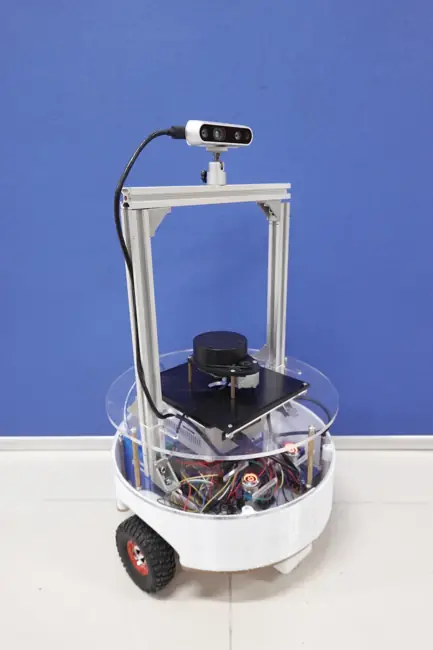

# Human-Aware Social Navigation

<table>
  <tr>
    <td align="center" width="36%">
      
    </td>
    <td align="center" width="64%">
      
    </td>
  </tr>
  <tr>
    <td align="center"><b>Real Robot</b></td>
    <td align="center"><b>CAD Model</b></td>
  </tr>
</table>

A ROS 2 Jazzy research platform for **human-aware / socially-aware mobile robot navigation** on a real differential-drive robot. The project is built and calibrated on top of [linorobot2](https://github.com/linorobot/linorobot2) and [linorobot2_hardware](https://github.com/linorobot/linorobot2_hardware), then extended toward RGB-D human perception, persistent multi-human tracking, asymmetric social-space modeling, socially-aware global planning, predictive local navigation, and an independent physical safety layer.

> **Upstream relationship.** The low-level robot controller, micro-ROS communication pattern, odometry, robot_localization, URDF/TF structure, SLAM Toolbox, AMCL, Nav2 bringup, RViz and Gazebo workflow originate from the Jazzy branch of linorobot2. This repository contains the robot-specific calibration, hardware configuration, launch changes, real-sensor integration, navigation tuning, and the Human-Aware / Social Navigation research extensions.

---

## Table of Contents

1. [Project Goals](#1-project-goals)
2. [System Architecture](#2-system-architecture)
3. [Verified Real-Robot Platform](#3-verified-real-robot-platform)
4. [Repository Structure](#4-repository-structure)
5. [Low-Level Firmware and Calibration](#5-low-level-firmware-and-calibration)
6. [ESP32 Pin Mapping](#6-esp32-pin-mapping)
7. [ROS 2 Base Stack](#7-ros-2-base-stack)
8. [TF and Coordinate Frames](#8-tf-and-coordinate-frames)
9. [RPLIDAR A1M8](#9-rplidar-a1m8)
10. [Intel RealSense D435](#10-intel-realsense-d435)
11. [Odometry and EKF](#11-odometry-and-ekf)
12. [SLAM and Localization](#12-slam-and-localization)
13. [Checked-In Nav2 Baseline](#13-checked-in-nav2-baseline)
14. [Human-Aware Research Pipeline](#14-human-aware-research-pipeline)
15. [RGB-D Human Perception](#15-rgb-d-human-perception)
16. [Multi-Human Tracking](#16-multi-human-tracking)
17. [Human State Representation](#17-human-state-representation)
18. [AGHPM Social-Space Model](#18-aghpm-social-space-model)
19. [Cost-Aware Global Planning](#19-cost-aware-global-planning)
20. [Predictive Human-Aware Local Planning](#20-predictive-human-aware-local-planning)
21. [Independent LiDAR Safety Layer](#21-independent-lidar-safety-layer)
22. [Important ROS Topics](#22-important-ros-topics)
23. [Build and Installation](#23-build-and-installation)
24. [Real-Robot Bringup](#24-real-robot-bringup)
25. [Mapping and Navigation Commands](#25-mapping-and-navigation-commands)
26. [Human-Aware Launch Integration](#26-human-aware-launch-integration)
27. [Calibration Procedure](#27-calibration-procedure)
28. [Performance-Oriented Design Decisions](#28-performance-oriented-design-decisions)
29. [Known Snapshot Caveats](#29-known-snapshot-caveats)
30. [Evaluation Metrics](#30-evaluation-metrics)
31. [Troubleshooting](#31-troubleshooting)
32. [Credits and License](#32-credits-and-license)

---

## 1. Project Goals

The project has two layers:

### 1.1 Real mobile-robot platform

Build a stable indoor navigation platform with:

- calibrated differential-drive kinematics;
- encoder odometry;
- ROS 2 Jazzy + micro-ROS;
- RPLIDAR-based mapping and obstacle sensing;
- RGB-D sensing with Intel RealSense D435;
- SLAM Toolbox for mapping;
- AMCL for localization;
- Nav2 for autonomous navigation;
- reproducible hardware/firmware configuration.

### 1.2 Human-aware / social navigation research

Extend the base robot from conventional obstacle avoidance toward a system that can:

- detect multiple people;
- estimate 3D human positions from RGB-D;
- maintain persistent IDs;
- estimate velocity and uncertainty;
- infer body orientation and motion heading;
- model asymmetric personal/social space;
- preserve social information during short observation gaps;
- plan globally around social cost;
- predict future robot-human interactions locally;
- keep physical collision safety independent from semantic perception.

The intended final research architecture is:

```text
RGB image + aligned depth
          │
          ▼
      YOLO Pose
          │
          ▼
Robust RGB-D 3D human detections
          │
          ▼
Hungarian data association
          │
          ▼
   Kalman track manager
          │
          ├── persistent ID
          ├── position
          ├── velocity
          ├── covariance
          └── motion state
          │
          ▼
Body orientation + motion heading
          │
          ▼
Structured multi-human state list
          │
     ┌────┴────┐
     ▼         ▼
Group logic   Future prediction
     └────┬────┘
          ▼
Uncertainty-/motion-aware AGHPM
          │
   ┌──────┴───────────────┐
   ▼                      ▼
2D social costmap   time-indexed human states
   │                      │
   ▼                      │
Cost-Aware A*             │
   │                      │
   ▼                      │
Global social path ───────┘
          │
          ▼
Predictive Human-Aware DWA
          │
          ▼
       v*, ω*
          │
          ▼
        Robot
```

The key design principle is that the **global planner may consume a 2D social costmap, but the local planner should also receive structured tracked-human states** so it can compare predicted robot and human states at the same future timestamps.

---

## 2. System Architecture

### 2.1 Base navigation architecture

```text
                    ┌──────────────────────┐
                    │  Intel RealSense D435│
                    └──────────┬───────────┘
                               │ RGB / Depth
                               │
┌──────────────────┐           │
│ RPLIDAR A1M8     │           │
│ /scan            │           │
└────────┬─────────┘           │
         │                     │
         ▼                     ▼
┌──────────────────────────────────────────┐
│               ROS 2 Jazzy                │
│                                          │
│ robot_state_publisher / TF               │
│ robot_localization EKF                   │
│ SLAM Toolbox / AMCL                      │
│ Nav2                                     │
└─────────────────────┬────────────────────┘
                      │ /cmd_vel
                      ▼
             ┌──────────────────┐
             │ micro-ROS Agent  │
             └────────┬─────────┘
                      │ serial
                      ▼
             ┌──────────────────┐
             │ ESP32 NodeMCU-32S│
             │ PID + kinematics │
             └──────┬─────┬─────┘
                    │     │
             ┌──────▼┐   ┌▼───────────────┐
             │BTS7960│   │Wheel encoders  │
             │drivers│   │+ MPU9250       │
             └───┬───┘   └───────────────┘
                 │
                 ▼
              Motors
```

### 2.2 Human-aware extension

```text
D435 RGB-D ──> YOLO Pose ──> 3D humans ──┐
                                         │
RPLIDAR /scan ────────────────────────────┤
                                         ▼
                                Multi-human tracking
                              Hungarian + Kalman filter
                                         │
                                         ▼
                              /planning/tracked_humans
                                /                    \
                               /                      \
                              ▼                        ▼
                         AGHPM field          Predictive local planner
                              │                        │
                              ▼                        │
                    socially-aware map/path ──────────┘
                                       │
                                       ▼
                                  velocity command
                                       │
                                       ▼
                              physical safety layer
                                       │
                                       ▼
                                      robot
```

---

## 3. Verified Real-Robot Platform

| Item | Real-robot configuration |
|---|---|
| Drive | 2WD differential drive |
| Robot computer | Intel NUC |
| OS | Ubuntu 24.04 |
| ROS | ROS 2 Jazzy |
| MCU | ESP32 NodeMCU-32S |
| Motor drivers | 2 × BTS7960 |
| Motors | 2 × DC geared motors with quadrature encoders |
| IMU | MPU9250 |
| 2D LiDAR | RPLIDAR A1M8 |
| RGB-D camera | Intel RealSense D435 |
| MCU transport | micro-ROS serial |
| MCU serial baud | 921600 |
| Visualization | RViz from the NUC or another ROS 2 workstation over LAN |

The real base configuration is defined in:

```text
linorobot2_hardware/config/custom/esp32_config.h
```

### Final measured calibration currently checked in

| Parameter | Value |
|---|---:|
| `LINO_BASE` | `DIFFERENTIAL_DRIVE` |
| Motor driver | `USE_BTS7960_MOTOR_DRIVER` |
| IMU | `USE_MPU9250_IMU` |
| Motor max RPM | 110 RPM |
| Maximum RPM ratio | 0.60 |
| Motor operating voltage | 12 V |
| Maximum motor supply voltage | 12 V |
| Measured supply voltage | 11.7 V |
| Encoder CPR, Motor 1 | 1799 |
| Encoder CPR, Motor 2 | 1799 |
| Wheel diameter | 0.09 m |
| Left-right wheel distance | 0.30 m |
| PID | Kp = 0.6, Ki = 0.8, Kd = 0.5 |
| PWM resolution | 10 bit |
| PWM frequency | 20 kHz |

The encoder CPR was manually re-measured on **2026-09-17** from repeated readings around 1796–1802 counts/revolution and set to **1799**. The wheel diameter was also re-measured and updated to **0.09 m**.

---

## 4. Repository Structure

```text
Human-Aware---Social-Navigation/
│
├── README.md
├── docs/
│   └── images/
│       ├── social_nav_real.webp
│       └── social_nav_cad.webp
│
├── linorobot2_hardware/
│   ├── calibration/
│   │   └── src/firmware.ino
│   ├── config/
│   │   ├── config.h
│   │   └── custom/
│   │       └── esp32_config.h
│   ├── firmware/
│   │   ├── lib/
│   │   │   ├── encoder/
│   │   │   ├── imu/
│   │   │   ├── kinematics/
│   │   │   ├── motor/
│   │   │   ├── odometry/
│   │   │   └── pid/
│   │   ├── src/firmware.ino
│   │   └── platformio.ini
│   └── test_motors/
│
└── linorobot2_ws1/
    └── src/
        ├── linorobot2/
        │   ├── linorobot2_base/
        │   ├── linorobot2_bringup/
        │   ├── linorobot2_description/
        │   ├── linorobot2_gazebo/
        │   └── linorobot2_navigation/
        ├── linorobot2_viz/
        ├── micro_ros_setup/
        ├── uros/
        ├── social_nav/
        └── thesis_msgs/
```

Generated products are intentionally not versioned:

```text
build/
install/
log/
.pio/
__pycache__/
```

---

## 5. Low-Level Firmware and Calibration

The low-level controller follows the linorobot2_hardware architecture.

### 5.1 Command path

```text
/cmd_vel
   │
   ▼
micro-ROS subscriber
   │
   ▼
Differential-drive inverse kinematics
   │
   ▼
left/right wheel target RPM
   │
   ▼
PID wheel-speed control
   │
   ▼
BTS7960 RPWM / LPWM
   │
   ▼
DC motors
```

### 5.2 Feedback path

```text
quadrature encoders
        │
        ▼
wheel angular velocity
        │
        ▼
differential-drive forward kinematics
        │
        ▼
/odom/unfiltered
```

The firmware also publishes IMU data from the MPU9250.

### 5.3 Accelerometer correction

The measured at-rest acceleration magnitude was approximately 10.68 m/s² rather than 9.81 m/s², therefore the checked-in configuration applies:

```text
9.81 / 10.68 = 0.918230
```

to all three accelerometer axes.

### 5.4 Motor and encoder inversion

The physical mounting requires both drive motors and both encoder signs to be inverted:

```text
MOTOR1_INV          = true
MOTOR2_INV          = true
MOTOR1_ENCODER_INV  = true
MOTOR2_ENCODER_INV  = true
```

---

## 6. ESP32 Pin Mapping

### Encoders

| Signal | GPIO |
|---|---:|
| Motor 1 Encoder A | 18 |
| Motor 1 Encoder B | 19 |
| Motor 2 Encoder A | 16 |
| Motor 2 Encoder B | 17 |

### BTS7960 PWM/control

| Driver signal | GPIO |
|---|---:|
| Motor 1 RPWM | 33 |
| Motor 1 LPWM | 26 |
| Motor 1 R_EN | 32 |
| Motor 1 L_EN | 25 |
| Motor 2 RPWM | 27 |
| Motor 2 LPWM | 14 |
| Motor 2 R_EN | 13 |
| Motor 2 L_EN | 12 |

### I²C

| Signal | GPIO |
|---|---:|
| SDA | 21 |
| SCL | 22 |

The I²C bus is initialized at 400 kHz.

---

## 7. ROS 2 Base Stack

The robot keeps the standard linorobot2 ROS 2 organization:

```text
ESP32
 ├── /odom/unfiltered
 └── /imu/data
        │
        ▼
robot_localization
        │
        ▼
      /odom
        │
        ├── SLAM Toolbox
        ├── AMCL
        └── Nav2
```

Important upstream components:

- **linorobot2_base** — EKF / base state estimation;
- **linorobot2_description** — robot URDF and TF;
- **linorobot2_bringup** — base, LiDAR, depth-camera and extra launch files;
- **linorobot2_navigation** — SLAM, AMCL and Nav2;
- **linorobot2_gazebo** — simulation;
- **linorobot2_viz** — RViz visualization;
- **micro_ros_setup / micro-ROS Agent** — ROS 2 ↔ MCU communication.

---

## 8. TF and Coordinate Frames

The expected navigation chain is:

```text
map
 └── odom
      └── base_footprint
           └── base_link
                ├── laser
                ├── imu_link
                └── camera_link
                     ├── camera color optical frame
                     └── camera depth optical frame
```

Responsibility:

- `map -> odom`: SLAM Toolbox or AMCL;
- `odom -> base_footprint`: robot_localization;
- `base_footprint -> base_link -> sensors`: robot_state_publisher / URDF.

The checked-in 2WD URDF currently places:

- LiDAR origin near `xyz="0.12 0 0.33"`;
- depth-camera origin near `xyz="0.14 0 0.045"`.

These are model values and must remain consistent with the physical mounting used during experiments.

---

## 9. RPLIDAR A1M8

The real robot uses an RPLIDAR A1 through `sllidar_ros2`.

Typical device assignment:

```text
ESP32       -> /dev/ttyUSB0
RPLIDAR A1  -> /dev/ttyUSB1
symlink     -> /dev/rplidar
```

Create/update the symlink:

```bash
sudo ln -sfn /dev/ttyUSB1 /dev/rplidar
```

The linorobot2 laser launcher selects the A1 launch file when:

```bash
export LINOROBOT2_LASER_SENSOR=a1
```

The A1 launch uses:

- serial device: `/dev/rplidar`;
- nominal baud: 115200;
- frame supplied by the linorobot2 launch stack.

For the deployed robot, the navigation scan should be the **filtered scan**, not a scan containing robot-body returns.

---

## 10. Intel RealSense D435

The D435 provides RGB and depth for human perception.

### Real-robot operating target

```text
RGB:   640 × 480 @ 15 FPS
Depth: 640 × 480 @ 15 FPS
```

### Critical alignment rule

YOLO keypoints are measured in RGB pixel coordinates. Therefore the depth value used for 3D back-projection must refer to the **same pixel geometry**.

The social-navigation launch explicitly enables:

```text
align_depth.enable = true
```

and uses:

```text
/camera/aligned_depth_to_color/image_raw
```

for the real D435.

This fixes a previously important failure mode: enabling depth alignment but accidentally reading `/camera/depth/image_rect_raw`, which is still in the original depth-camera geometry.

### Namespace handling

The custom launch removes the duplicated `/camera/camera/...` namespace by launching RealSense with an empty `camera_namespace`. This keeps simulation and hardware topics consistent around:

```text
/camera/color/image_raw
/camera/color/camera_info
/camera/aligned_depth_to_color/image_raw
```

### Initial hardware reset

The D435 can be started with `initial_reset=true` to recover from USB/driver states where the ROS node exists but image frames are not actually published.

---

## 11. Odometry and EKF

Configuration:

```text
linorobot2_ws1/src/linorobot2/linorobot2_base/config/ekf.yaml
```

Current settings:

- update frequency: 20 Hz;
- `two_d_mode: true`;
- publishes TF;
- world frame: `odom`;
- base frame: `base_footprint`;
- input: `odom/unfiltered`.

### Why IMU yaw is currently not fused

The checked-in real-robot EKF intentionally does **not** fuse MPU9250 yaw/yaw-rate. During commissioning, a stationary gyro-Z reading around -0.24 rad/s caused false yaw motion when fused.

The current policy is:

1. use wheel odometry as the EKF motion input;
2. let AMCL correct long-term `map -> odom` drift;
3. only re-enable IMU yaw after gyro bias is calibrated close to zero and real driving tests show improved heading estimation.

---

## 12. SLAM and Localization

### Mapping

The project uses **SLAM Toolbox** for 2D mapping from:

- filtered LiDAR scan;
- odometry;
- TF.

Conceptually:

```text
/scan + /odom + TF
        │
        ▼
   SLAM Toolbox
        │
        ├── /map
        └── map -> odom
```

### Localization

For navigation on a saved occupancy grid, **AMCL** provides localization and publishes the `map -> odom` correction.

The current Nav2 configuration uses:

- `base_frame_id: base_footprint`;
- `odom_frame_id: odom`;
- `global_frame_id: map`;
- `scan_topic: scan`;
- differential motion model.

The custom navigation launcher also writes the requested initial pose directly into a temporary Nav2 parameter file, because the Jazzy Nav2 bringup launch does not consume arbitrary `initial_pose_x/y/yaw` arguments by itself.

---

## 13. Checked-In Nav2 Baseline

The repository currently contains a conventional Nav2 baseline in:

```text
linorobot2_navigation/config/navigation.yaml
```

### Local controller

The checked-in controller chain is:

```text
RotationShimController
        │
        ▼
RegulatedPurePursuitController
```

Relevant baseline parameters include:

| Parameter | Value |
|---|---:|
| Controller frequency | 20 Hz |
| Desired linear velocity | 0.4 m/s |
| Lookahead distance | 0.6 m |
| XY goal tolerance | 0.35 m |
| Yaw goal tolerance | 0.35 rad |
| Local costmap size | 3 m × 3 m |
| Costmap resolution | 0.05 m |
| Robot radius in current YAML | 0.22 m |
| Inflation radius | 0.70 m |

### Global planner

The checked-in baseline uses:

```text
nav2_navfn_planner::NavfnPlanner
```

with:

```yaml
use_astar: false
```

This baseline is useful as a conventional navigation reference. The Human-Aware research architecture described below extends beyond this baseline with social cost and predictive local behavior.

---

## 14. Human-Aware Research Pipeline

The project's research architecture should not be reduced to “YOLO + A* + DWA”. Its intended contributions are layered:

1. robust multi-human state estimation;
2. persistent association;
3. uncertainty-aware and orientation-aware social representation;
4. socially-aware global planning;
5. time-aligned predictive local avoidance;
6. physical safety separated from social comfort.

The research pipeline is:

```text
YOLO Pose + RGB-D
      ↓
Robust human measurements
      ↓
Hungarian association
      ↓
Kalman tracking
      ↓
{ID, x, y, vx, vy, heading, covariance, confidence}
      ↓
group detection + future prediction
      ↓
AGHPM
      ↓
Cost-Aware A* global planning
      ↓
Predictive Human-Aware DWA
      ↓
physical safety checks
      ↓
robot
```

---

## 15. RGB-D Human Perception

The perception design uses **pose**, not only a bounding box.

Why pose matters:

- body keypoints provide more stable localization cues than the bounding-box center;
- body geometry provides orientation cues;
- orientation is required for asymmetric personal space.

### Robust 3D position estimation

For a detected person, the preferred localization cue is the midpoint of stable body keypoints, especially the hips.

For example:

```text
u_h = (u_left_hip + u_right_hip) / 2
v_h = (v_left_hip + v_right_hip) / 2
```

Instead of using one noisy depth pixel, use the median depth in a small neighborhood:

```text
Z = median(depth patch around (u_h, v_h))
```

Then back-project using camera intrinsics:

```text
X = (u - cx) Z / fx
Y = (v - cy) Z / fy
Z = depth
```

Finally transform the point into a common tracking frame such as `odom`.

Fallback keypoints can be used when the hips are unavailable, e.g. knees and then ankles.

---

## 16. Multi-Human Tracking

The intended tracker uses:

- gated measurement association;
- Hungarian assignment;
- constant-velocity Kalman filtering;
- persistent IDs;
- track confirmation;
- coasting during short observation gaps;
- covariance propagation;
- camera/LiDAR measurement support;
- ID revival / short-term memory.

A typical constant-velocity state is:

```text
x = [x, y, vx, vy]ᵀ
```

### Prediction

```text
x(k+1) = F x(k)
```

with process noise describing unmodeled human acceleration.

### Measurement update

RGB-D and LiDAR should be treated as measurements with their own uncertainty rather than directly averaged.

The intended sequence is:

```text
camera detections ─┐
                   ├─> association ─> matched track ─> KF update
LiDAR observations ┘
```

### Why covariance is preserved

Kalman covariance is not only a tracking-internal quantity. It can also inform:

- association gating;
- human-state confidence;
- future prediction uncertainty;
- social-space enlargement;
- conservative local planning when a track becomes uncertain.

---

## 17. Human State Representation

For each tracked human `i`, the research state is conceptually:

```text
H_i = {
  ID_i,
  x_i, y_i,
  vx_i, vy_i,
  theta_i,
  P_i,
  confidence_i,
  group_id_i
}
```

where:

- `ID` — persistent track identity;
- `x, y` — position;
- `vx, vy` — translational velocity;
- `theta` — body orientation or selected social heading;
- `P` — Kalman covariance;
- `confidence` — perception/tracking reliability;
- `group_id` — social group membership when available.

The intended tracking output topic is:

```text
/planning/tracked_humans
```

---

## 18. AGHPM Social-Space Model

AGHPM is the project's core social representation.

The model is intended to be:

- asymmetric;
- orientation-aware;
- motion-adaptive;
- uncertainty-aware;
- group-aware;
- predictive.

### 18.1 Asymmetric personal space

A person's front, side and rear regions should not have identical cost.

Conceptually:

```text
             larger frontal space
                    ↑
             . . . . . . .
          .               .
        .       human       .
          .               .
             . . . . .
                    ↓
              smaller rear
```

The current social-navigation launch comments reference a front/rear asymmetry around:

```text
sigma_front ≈ 0.50 m
sigma_back  ≈ 0.30 m
```

These are project tuning values, not universal social-distance constants.

### 18.2 Motion and body orientation

Maintain two cues:

- **body orientation** from pose;
- **motion heading** from velocity.

A stationary person can still have a meaningful facing direction even when velocity is near zero.

### 18.3 Uncertainty-aware field

A conceptual extension is:

```text
sigma_eff = sigma_AGHPM + k * sqrt(P_xx + P_yy)
```

so the social field expands as state uncertainty increases.

### 18.4 Future social field

For predicted future position:

```text
p_i(t + tau) = p_i(t) + v_i * tau
```

AGHPM can be extended from a single spatial field:

```text
C(x, y)
```

to a time-indexed field:

```text
C(x, y, t)
```

A velocity-elongated Gaussian alone should not be treated as equivalent to explicit future trajectory prediction.

---

## 19. Cost-Aware Global Planning

The intended global planner combines occupancy cost and social cost.

Conceptually:

```text
J_global =
    map obstacle cost
  + inflation cost
  + AGHPM social cost
```

A Cost-Aware A* planner can therefore choose a slightly longer path if it significantly reduces social-space intrusion.

The role of the global planner is not to predict detailed short-term encounters at controller frequency. Its role is to shape the route at a larger scale.

---

## 20. Predictive Human-Aware Local Planning

The local planner should evaluate candidate robot trajectories against **future human states at matching timestamps**.

A generic candidate score can include:

```text
J =
  w_goal      * goal_progress
+ w_path      * path_tracking
+ w_speed     * speed_preference
+ w_social    * social_field_cost
+ w_human     * human_distance_risk
+ w_ttc       * time_to_collision_risk
+ w_heading   * heading_alignment
+ w_smooth    * command_smoothness
```

For each candidate robot trajectory:

```text
robot(t0), robot(t1), ..., robot(tN)
```

compare it with predicted human states:

```text
human_i(t0), human_i(t1), ..., human_i(tN)
```

rather than evaluating the entire trajectory against only a static 2D human position.

Physical admissibility and braking constraints should be applied before or alongside social scoring.

---

## 21. Independent LiDAR Safety Layer

Social navigation and physical collision safety should remain separate.

The intended safety structure is:

```text
planner/controller
       │
       ▼
velocity smoothing
       │
       ▼
Nav2 Collision Monitor
       │
       ▼
custom LiDAR stop/slow/TTC guard
       │
       ▼
     /cmd_vel
       │
       ▼
      ESP32
```

The safety layer should remain functional even if:

- YOLO fails;
- tracking is temporarily lost;
- social-space estimation is wrong;
- a person or object is not semantically recognized.

The custom `navigation.launch.py` already contains integration hooks for Python/C++ implementations of `lidar_safety_node1`.

---

## 22. Important ROS Topics

| Topic | Purpose |
|---|---|
| `/cmd_vel` | final base command |
| `/odom/unfiltered` | wheel odometry from ESP32 |
| `/odom` | EKF output |
| `/imu/data` | MPU9250 data |
| `/scan` | navigation LiDAR scan |
| `/camera/color/image_raw` | RGB stream |
| `/camera/color/camera_info` | RGB camera intrinsics |
| `/camera/aligned_depth_to_color/image_raw` | depth aligned to RGB |
| `/planning/tracked_humans` | intended structured tracked-human output |
| `/map` | occupancy grid |
| `/tf`, `/tf_static` | transform tree |

Useful diagnostics:

```bash
ros2 topic list
ros2 topic hz /odom
ros2 topic hz /scan
ros2 topic hz /camera/color/image_raw
ros2 topic echo /odom --once
ros2 run tf2_ros tf2_echo odom base_footprint
```

---

## 23. Build and Installation

### 23.1 ROS 2

Use Ubuntu 24.04 with ROS 2 Jazzy.

The upstream linorobot2 installer and documentation are available at:

- <https://github.com/linorobot/linorobot2>
- <https://linorobot.github.io/linorobot2/>

### 23.2 Clone this repository

```bash
git clone https://github.com/DucMinhLe2005/Human-Aware---Social-Navigation.git
cd Human-Aware---Social-Navigation
```

### 23.3 Build the ROS 2 workspace

```bash
cd linorobot2_ws1
rosdep install --from-paths src --ignore-src -r -y
colcon build --symlink-install
source install/setup.bash
```

### 23.4 Build ESP32 firmware

Install PlatformIO first, then:

```bash
cd linorobot2_hardware/firmware
pio run -e esp32
```

Upload:

```bash
pio run -e esp32 -t upload --upload-port /dev/ttyUSB0
```

The PlatformIO configuration targets:

- ESP32 NodeMCU-32S;
- ROS 2 Jazzy micro-ROS;
- serial transport;
- 921600 baud.

---

## 24. Real-Robot Bringup

### 24.1 Prepare devices

```bash
sudo chmod 666 /dev/ttyUSB0 /dev/ttyUSB1
sudo ln -sfn /dev/ttyUSB1 /dev/rplidar
```

### 24.2 Environment

```bash
export ROS_DOMAIN_ID=0
export FASTDDS_BUILTIN_TRANSPORTS=UDPv4
export LINOROBOT2_BASE=2wd
export LINOROBOT2_LASER_SENSOR=a1
```

If a specific map is selected by the custom navigation launcher:

```bash
export LINOROBOT2_MAP=<map_name>
```

### 24.3 Bring up the robot

```bash
cd linorobot2_ws1
source install/setup.bash

ros2 launch linorobot2_bringup bringup.launch.py \
  base_serial_port:=/dev/ttyUSB0 \
  extra:=true
```

The standard micro-ROS data path should expose at least:

```text
/cmd_vel
/odom/unfiltered
/imu/data
```

and the EKF should publish:

```text
/odom
```

---

## 25. Mapping and Navigation Commands

### 25.1 Mapping

```bash
ros2 launch linorobot2_navigation slam.launch.py
```

Drive the robot using teleoperation:

```bash
ros2 run teleop_twist_keyboard teleop_twist_keyboard
```

Save a map:

```bash
ros2 run nav2_map_server map_saver_cli -f <map_name> \
  --ros-args -p save_map_timeout:=10000.
```

### 25.2 Navigation

```bash
ros2 launch linorobot2_navigation navigation.launch.py \
  map:=/absolute/path/to/<map_name>.yaml
```

The custom launcher also supports:

```text
initial_pose_x
initial_pose_y
initial_pose_yaw
sim
rviz
lidar_safety
safety_impl
```

---

## 26. Human-Aware Launch Integration

Custom integration file:

```text
linorobot2_bringup/launch/social_nav.launch.py
```

The launch file is designed to coordinate:

- RealSense D435 startup;
- aligned depth;
- YOLO pose perception;
- Python/C++ tracker selection;
- simulation time;
- unified camera topics.

Important launch arguments:

| Argument | Default | Meaning |
|---|---|---|
| `sim` | `false` | use Gazebo `/clock` |
| `camera` | `false` | launch the physical D435 |
| `camera_reset` | `true` | hard-reset D435 at startup |
| `camera_prefix` | `/camera` | camera topic prefix |
| `debug_image` | `false` | publish annotated perception image |
| `tracker_impl` | `cpp` | select C++ or Python tracker |

Example intended real-robot invocation:

```bash
ros2 launch linorobot2_bringup social_nav.launch.py \
  camera:=true \
  tracker_impl:=cpp
```

For Gazebo:

```bash
ros2 launch linorobot2_bringup social_nav.launch.py \
  sim:=true \
  camera:=false \
  tracker_impl:=cpp
```

The launch comments document an important simulation fix: every perception/tracking node must use `use_sim_time=true` in Gazebo, otherwise TF lookups mix wall-clock time with simulated time.

---

## 27. Calibration Procedure

The custom calibration firmware is located at:

```text
linorobot2_hardware/calibration/src/firmware.ino
```

### Safety first

Elevate the robot so the wheels cannot drive the robot off the bench.

### 27.1 Verify motor direction

Build/upload the calibration firmware, then test each motor.

If a wheel rotates backward, change the corresponding:

```text
MOTOR1_INV
MOTOR2_INV
```

### 27.2 Verify encoder sign

Forward wheel motion should produce a positive logical count after inversion is applied.

If not, change:

```text
MOTOR1_ENCODER_INV
MOTOR2_ENCODER_INV
```

### 27.3 Manual CPR measurement

The custom calibration code supports a manual ten-revolution test.

Conceptually:

1. reset encoder;
2. rotate one wheel exactly 10 turns by hand;
3. read the encoder count;
4. compute:

```text
CPR = |count| / 10
```

5. repeat several times;
6. use the measured mean/representative value.

The final checked-in value is 1799 for both drive wheels.

### 27.4 Geometry

Measure:

- wheel diameter at the effective rolling surface;
- center-to-center left/right wheel distance.

Do not rely on a generic upstream robot dimension when accurate odometry is required.

---

## 28. Performance-Oriented Design Decisions

The robot computer is CPU-oriented, so the project intentionally avoids unnecessary processing.

Examples already reflected in the launch design:

- RealSense point cloud disabled when not needed;
- optional debug image disabled by default;
- aligned depth used only for RGB-D human localization;
- C++ tracker selected by default;
- social perception period can be lower than the camera frame rate;
- LiDAR remains the independent safety sensor.

The launch comments record local tests where the C++ tracker was substantially lighter than the Python implementation, motivating `tracker_impl:=cpp` as the default.

---

## 29. Known Snapshot Caveats

This repository is an active research snapshot. Before claiming a fully reproducible Human-Aware build, check the following items.

### 29.1 Social-navigation source synchronization

The checked-in launch files already reference packages such as:

```text
social_nav_perception
social_nav_tracking
social_nav_tracking_cpp
social_nav_safety
social_nav_safety_cpp
```

The full development workspace must contain those packages for the Human-Aware launch path to run.

### 29.2 Baseline Nav2 file vs research planner

The currently checked-in `navigation.yaml` still represents a conventional baseline:

- Rotation Shim + Regulated Pure Pursuit;
- Navfn with `use_astar: false`;
- no AGHPM plugin in the shown local/global costmap plugin lists.

Therefore, treat this YAML as the **baseline Nav2 configuration**, not as proof that Cost-Aware A* + Predictive Human-Aware DWA are already active in every clone.

### 29.3 Velocity safety-chain consistency

The custom `navigation.launch.py` describes a chain in which Nav2 Collision Monitor should output `cmd_vel_raw` so the custom LiDAR safety node can publish the final `cmd_vel`.

However, the checked-in `navigation.yaml` currently has:

```yaml
cmd_vel_out_topic: "cmd_vel"
```

Before enabling the custom safety node, make the velocity-topic chain consistent so two nodes do not compete for `/cmd_vel` and the safety node is actually interposed.

### 29.4 URDF vs measured wheel geometry

The measured firmware value is:

```text
wheel diameter = 0.09 m
```

while the checked-in `2wd_properties.urdf.xacro` currently uses:

```text
wheel_radius = 0.04 m
```

For accurate simulation-to-real comparison, synchronize the URDF wheel geometry with the final measured hardware geometry.

These caveats are documented deliberately so the repository remains technically auditable rather than hiding configuration drift.

---

## 30. Evaluation Metrics

Recommended metrics for the research stack:

### Perception and tracking

- 3D position RMSE;
- velocity RMSE;
- orientation MAE;
- ID switches;
- IDF1;
- MOTA/HOTA when ground truth supports them.

### Prediction

- Average Displacement Error (ADE);
- Final Displacement Error (FDE).

### Navigation

- success rate;
- collision rate;
- navigation time;
- path length;
- minimum human distance;
- minimum TTC;
- personal-space intrusion ratio;
- integrated social cost.

### Motion quality

- angular velocity;
- acceleration;
- jerk;
- stop-and-go frequency.

### Real-time feasibility

Measure runtime for:

- perception;
- tracking;
- AGHPM update;
- global planning;
- local planning;
- safety node.

---

## 31. Troubleshooting

### ESP32 is not publishing odometry

```bash
ls -l /dev/ttyUSB0
ros2 topic echo /odom/unfiltered
```

Check:

- serial permissions;
- micro-ROS agent;
- firmware transport;
- 921600 baud;
- correct ESP32 environment.

### RPLIDAR does not start

```bash
ls -l /dev/rplidar
ros2 topic hz /scan
```

Recreate the symlink if necessary:

```bash
sudo ln -sfn /dev/ttyUSB1 /dev/rplidar
```

### Robot moves in RViz while physically stationary

Inspect the odometry/EKF input. The current real-robot configuration intentionally excludes IMU yaw because of gyro bias observed during commissioning.

### AMCL never publishes a valid map-to-odom transform

Check:

- initial pose;
- scan topic;
- map path;
- TF chain;
- whether the custom launcher successfully wrote the initial pose into the temporary parameter file.

### D435 node exists but no frames arrive

Check:

```bash
ros2 topic hz /camera/color/image_raw
ros2 topic hz /camera/aligned_depth_to_color/image_raw
```

Use the startup hardware reset if the device is stuck after an unclean previous shutdown.

### Human tracker cannot transform LiDAR/camera data in Gazebo

Make sure:

```text
sim:=true
```

so the nodes use simulated time rather than wall-clock time.

### Social navigation build cannot find a package

Confirm the full development social-navigation source tree is present under the ROS 2 workspace and rebuild with:

```bash
colcon build --symlink-install
source install/setup.bash
```

---

## 32. Credits and License

This work is built on the open-source ROS 2 mobile-robot ecosystem, especially:

- [linorobot2](https://github.com/linorobot/linorobot2)
- [linorobot2_hardware](https://github.com/linorobot/linorobot2_hardware)
- [ROS 2](https://docs.ros.org/)
- [Nav2](https://navigation.ros.org/)
- [micro-ROS](https://micro.ros.org/)
- [robot_localization](https://github.com/cra-ros-pkg/robot_localization)
- [SLAM Toolbox](https://github.com/SteveMacenski/slam_toolbox)
- [Intel RealSense ROS](https://github.com/IntelRealSense/realsense-ros)
- [SLLIDAR ROS 2](https://github.com/Slamtec/sllidar_ros2)

The upstream linorobot2 / linorobot2_hardware source files retain their original copyright and license notices.

See the repository license files for details.
