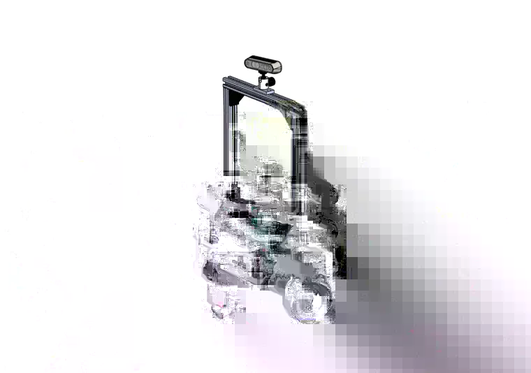

# Human-Aware Social Navigation

<p align="center">
  
  
</p>

<p align="center">
  <b>Real Robot</b> &nbsp;&nbsp;&nbsp;&nbsp;&nbsp;&nbsp;&nbsp;&nbsp; <b>CAD Model</b>
</p>

Human-aware mobile robot navigation system developed using ROS 2, integrating robot hardware, perception, localization, path planning, and socially-aware navigation.

## Project Structure

```text
Human-Aware-Social-Navigation/
├── linorobot2_hardware/    # Robot hardware and embedded firmware
├── linorobot2_ws1/         # ROS 2 workspace
└── README.md
```
