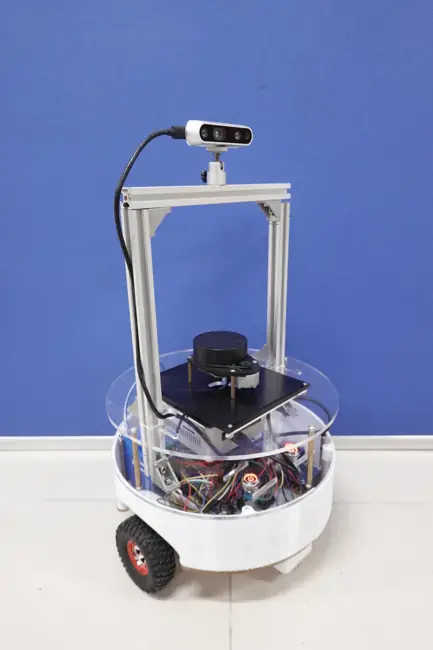
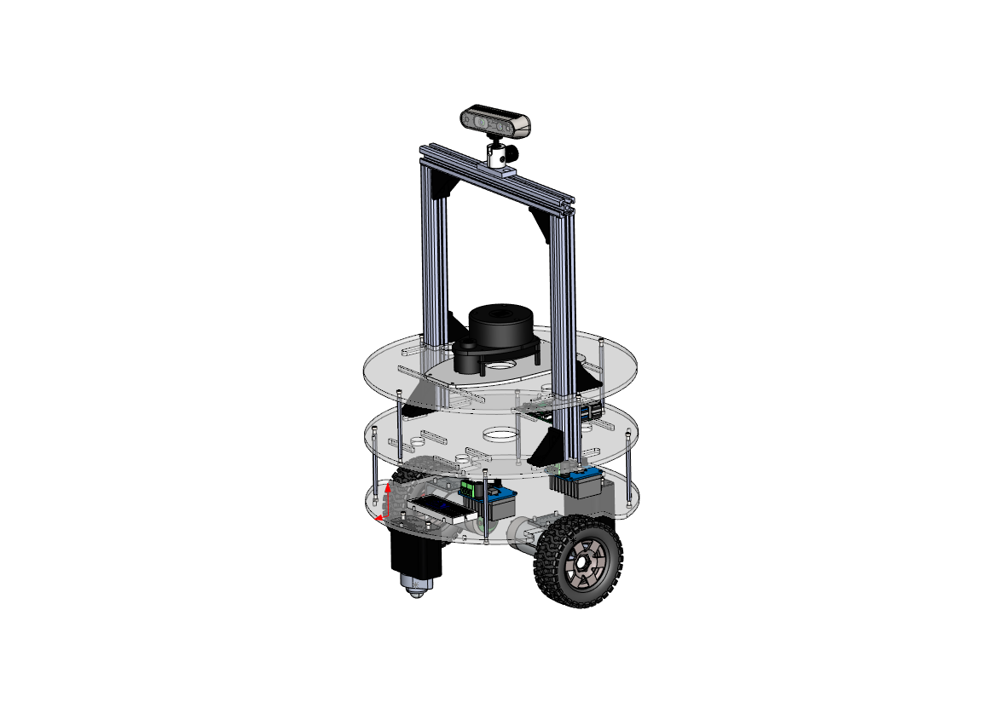
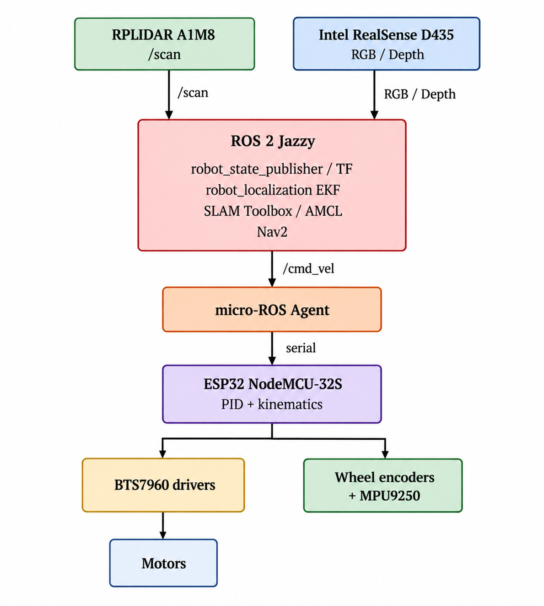
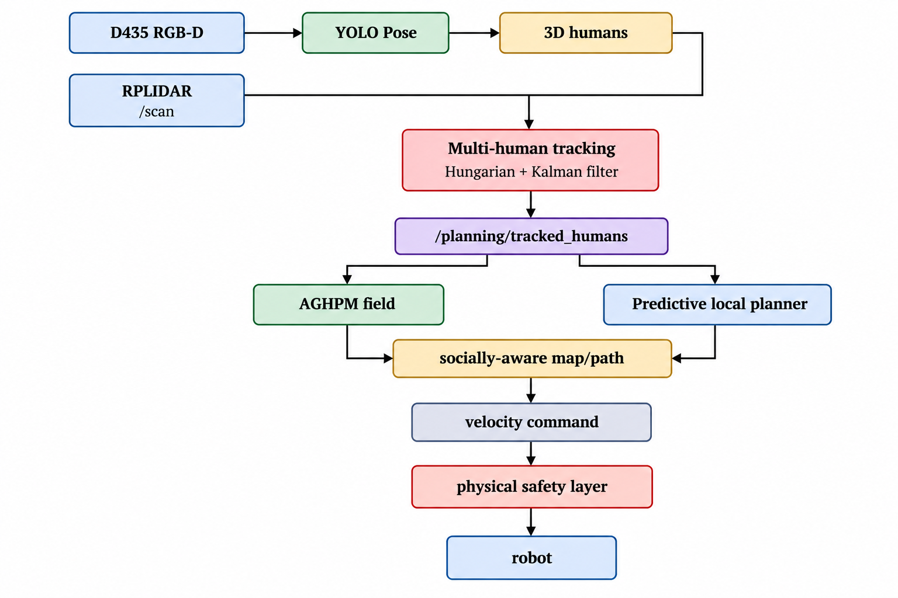
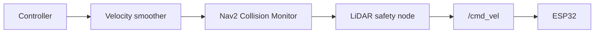
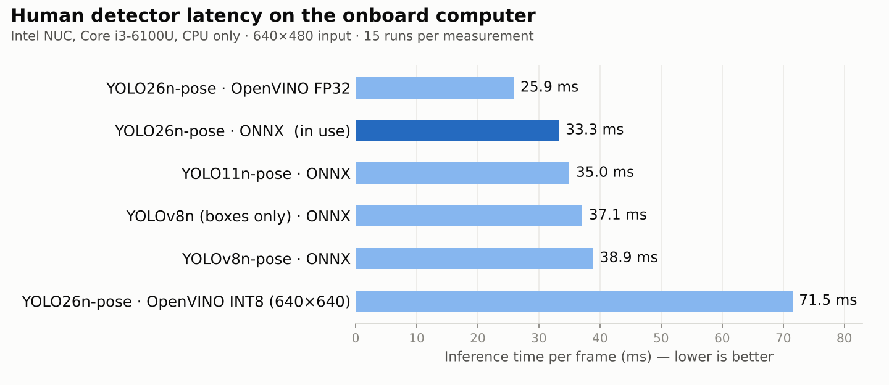
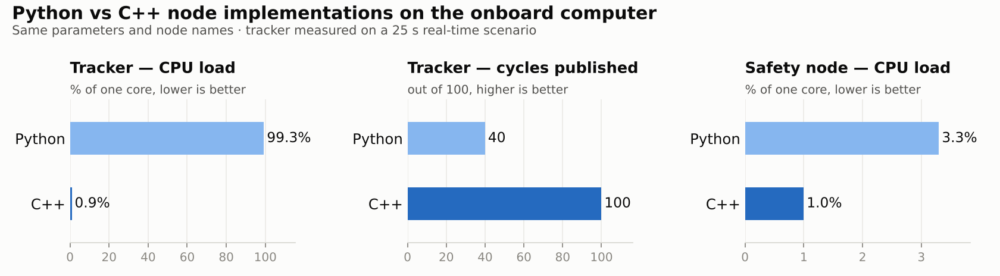

# Human-Aware Social Navigation on a Real Mobile Robot

A ROS 2 Jazzy research platform for studying how a mobile robot should move around people. It is built on a custom differential-drive robot with a 2D LiDAR and an RGB-D camera, and all computation runs on a CPU-only onboard computer.

|  |  |
|:---:|:---:|
| Real robot | CAD model |

**Author:** Le Duc Minh, Robotics-AI-BioMedical Laboratory, Hanoi University of Science and Technology

---

## Contents

1. [What this project is](#1-what-this-project-is)
2. [What is in this repository](#2-what-is-in-this-repository)
3. [The robot](#3-the-robot)
4. [System architecture](#4-system-architecture)
5. [Human-aware pipeline](#5-human-aware-pipeline)
6. [Measured results](#6-measured-results)
7. [Calibration and commissioning notes](#7-calibration-and-commissioning-notes)
8. [Build and run](#8-build-and-run)
9. [Known limitations of this snapshot](#9-known-limitations-of-this-snapshot)
10. [Roadmap and evaluation plan](#10-roadmap-and-evaluation-plan)
11. [Credits and license](#11-credits-and-license)

---

## 1. What this project is

A conventional navigation stack treats a person as one more obstacle. This project works toward a robot that knows the difference: it detects and tracks the people around it, represents the space they would like kept clear, and plans with that information at both the route level and the velocity level.

The project has two layers.

**Layer 1: a calibrated real-robot base.** Firmware, odometry, localization, mapping and a standard Nav2 baseline, all running on hardware I assembled and calibrated myself. This layer is complete and is what the code in this repository runs.

**Layer 2: human-aware navigation research.** RGB-D human perception, multi-human tracking, an asymmetric personal-space model (AGHPM), a social-cost-aware global planner, a predictive local planner, and a LiDAR safety layer that does not depend on perception. This layer is under active development in a separate workspace. Section 2 states exactly which parts are public.

The research question the platform is being built to answer is narrow on purpose:

> When a tracked person is briefly lost (occluded, outside the camera field of view, or missed by the detector), how should the robot keep, move and fade that person's social space so that it stays safe without becoming needlessly conservative?

---

## 2. What is in this repository

This is a snapshot of an ongoing project, so the table below separates what you can clone and run from what is described but not yet published here.

| Component | Status | Where |
|---|---|---|
| ESP32 firmware (PID wheel control, odometry, IMU, micro-ROS) | In this repository | `linorobot2_hardware/` |
| Robot-specific configuration and calibration values | In this repository | `linorobot2_hardware/config/custom/esp32_config.h` |
| Interactive calibration firmware (motor direction, encoder sign, CPR) | In this repository | `linorobot2_hardware/calibration/` |
| Robot description, bringup, EKF, SLAM, AMCL, Nav2 baseline | In this repository | `linorobot2_ws1/src/linorobot2/` |
| Launch integration for perception, tracking and the safety layer | In this repository | `linorobot2_bringup/launch/social_nav.launch.py`, `linorobot2_navigation/launch/navigation.launch.py` |
| Human perception node (`social_nav_perception`) | In this repository | `src_humanaware/src/social_nav/` |
| Multi-human tracker, Python and C++ (`social_nav_tracking`, `social_nav_tracking_cpp`) | In this repository | `src_humanaware/src/social_nav/` |
| LiDAR safety node, Python and C++ (`social_nav_safety`, `social_nav_safety_cpp`) | In this repository | `src_humanaware/src/social_nav/` |
| AGHPM social costmap layer (`social_nav_costmap_layer`) | In this repository | `src_humanaware/src/social_nav/` |
| Human-aware DWA local controller (`social_nav_controller`) | In this repository | `src_humanaware/src/social_nav/` |
| Gazebo scenario, metrics node and batch tools (`social_nav_gazebo`) | In this repository | `src_humanaware/src/social_nav/` |
| Closed-loop evaluation in simulation (100 runs) | Done | [`src_humanaware/docs/RESULTS.md`](src_humanaware/docs/RESULTS.md) |
| Closed-loop evaluation on the real robot | Not yet run | see [Section 10](#10-roadmap-and-evaluation-plan) |

The repository holds two workspaces. `linorobot2_ws1/` is the real-robot base workspace; its `social_nav/` and `thesis_msgs/` directories are placeholders marked with `COLCON_IGNORE`. `src_humanaware/` is the simulation workspace with the complete human-aware stack; it has its own [README](src_humanaware/README.md) with build, run and batch-evaluation instructions.

**Relationship to upstream.** The firmware and the base ROS 2 packages come from [linorobot2](https://github.com/linorobot/linorobot2) and [linorobot2_hardware](https://github.com/linorobot/linorobot2_hardware) (Apache-2.0). My work in this repository is the robot-specific hardware configuration and calibration, the changes to the PID and calibration firmware, the EKF and navigation launch changes, and the launch integration for the human-aware packages.

---

## 3. The robot

| Item | Configuration |
|---|---|
| Drive | Two-wheel differential drive with passive casters |
| Onboard computer | Intel NUC (Core i3-6100U, no GPU), Ubuntu 24.04, ROS 2 Jazzy |
| Microcontroller | ESP32 NodeMCU-32S, micro-ROS over serial at 921600 baud |
| Motor drivers | 2 × BTS7960 |
| Motors | 2 × 12 V DC gear motors with quadrature encoders |
| IMU | MPU9250 on I²C at 400 kHz |
| 2D LiDAR | RPLIDAR A1M8 |
| RGB-D camera | Intel RealSense D435, 640 × 480 at 15 FPS |

Final measured values, as checked in to `esp32_config.h`:

| Parameter | Value |
|---|---|
| Encoder counts per wheel revolution | 1799 (both wheels) |
| Wheel diameter | 0.09 m |
| Wheel separation | 0.30 m |
| Motor rated speed, allowed fraction | 110 RPM, 0.60 |
| Supply voltage, measured | 11.7 V |
| Wheel-speed PID | Kp 0.6, Ki 0.8, Kd 0.5 |
| PWM | 10 bit, 20 kHz |

<details>
<summary>ESP32 pin mapping</summary>

| Signal | GPIO | Signal | GPIO |
|---|---|---|---|
| Motor 1 encoder A / B | 18 / 19 | Motor 2 encoder A / B | 16 / 17 |
| Motor 1 RPWM / LPWM | 33 / 26 | Motor 2 RPWM / LPWM | 27 / 14 |
| Motor 1 R_EN / L_EN | 32 / 25 | Motor 2 R_EN / L_EN | 13 / 12 |
| I²C SDA / SCL | 21 / 22 | | |

Both motors and both encoders are inverted in the configuration to match how they are mounted.

</details>

---

## 4. System architecture

<p align="center">
  
</p>

The ESP32 closes the wheel-speed loop at 50 Hz and publishes wheel odometry (`/odom/unfiltered`) and IMU data (`/imu/data`). On the NUC, `robot_localization` produces `/odom`, SLAM Toolbox builds maps, AMCL localizes on a saved map, and Nav2 plans and controls.

**Frames**

```
map ── odom ── base_footprint ── base_link ──┬── laser
                                             ├── imu_link
                                             └── camera_link
```

`map → odom` comes from SLAM Toolbox or AMCL, `odom → base_footprint` from the EKF, and the sensor frames from the URDF.

**Nav2 baseline checked in** (`linorobot2_navigation/config/navigation.yaml`)

| Item | Setting |
|---|---|
| Global planner | NavFn (Dijkstra) |
| Local controller | Rotation Shim + Regulated Pure Pursuit, 20 Hz, 0.4 m/s |
| Local costmap | 3 m × 3 m rolling window, 0.05 m cells, voxel + inflation layers |
| Robot radius, inflation radius | 0.22 m, 0.70 m |
| Localization | AMCL, likelihood-field model, 500 to 2000 particles |
| Safety | Nav2 Collision Monitor, footprint approach |

This baseline is the reference that the human-aware planners will be compared against.

---

## 5. Human-aware pipeline

<p align="center">
  
</p>

**Perception.** A YOLO pose model runs on the color image. For each person, the midpoint of the hip keypoints is back-projected through the depth image aligned to color, which gives a 3D position, and the body keypoints give a facing direction. Pose is used instead of bounding boxes because the facing direction is what makes the personal-space model asymmetric. Detection runs every 0.3 s to leave CPU headroom for navigation.

**Tracking.** Detections are associated to tracks with the Hungarian algorithm and filtered with a constant-velocity Kalman filter. Each track carries a persistent ID, position, velocity, heading, covariance and confidence, and is published on `/planning/tracked_humans`. Camera and LiDAR observations are both used as measurements.

**Social-space model (AGHPM).** Personal space is modelled as an asymmetric Gaussian aligned with the person's heading: wider in front than behind. The current tuning is σ<sub>front</sub> = 0.50 m and σ<sub>back</sub> = 0.30 m. These are project tuning values, not universal constants. Planned extensions make the field grow with tracking uncertainty and shift with predicted motion.

**Planning.** The global planner adds social cost to obstacle cost, so a slightly longer route is accepted when it avoids cutting through someone's space. The local planner scores each candidate trajectory against where each person is predicted to be at the same instant, instead of against a static costmap.

**Safety.** Collision safety is deliberately kept independent of perception. The velocity command passes through the Nav2 Collision Monitor and then a LiDAR-only stop/slow node before it reaches the motors, so the robot still stops if detection or tracking fails.


```mermaid
flowchart LR
    A[Controller] --> B[Velocity smoother] --> C[Nav2 Collision Monitor] --> D[LiDAR safety node] --> E["/cmd_vel"] --> F[ESP32]
```

---

## 6. Measured results

The component benchmarks below were measured on the robot's own computer. The closed-loop results come from Gazebo; real-robot experiments are planned in [Section 10](#10-roadmap-and-evaluation-plan).

### Closed-loop navigation in simulation

The robot drives through a doorway past two standing people while a scripted pedestrian walks back and forth across its path at 0.7 m/s. The pedestrian does not react to the robot. Collisions and clearances are computed from ground-truth positions.

| Metric (100 valid runs) | Value |
|---|---|
| Runs with no collision | 91 % (95 % CI 84 to 95 %) |
| Collisions with standing people | 0 |
| Collisions in total | 12, all with the walking pedestrian |
| Minimum clearance to the pedestrian, median over runs | 0.56 m |
| Runs with clearance below 0.30 m | 28 % |
| Time to goal, median | 51.4 s |

Every remaining collision happens when the pedestrian turns around close to the robot. The tracker's constant-velocity Kalman filter needs about 1.2 s to follow a reversal, and the camera often cannot see the person at that angle. Two batches of identical code differed by up to about 9 points in the no-collision rate, so that rate should be read with its confidence interval. The scenario, protocol and a variant that was evaluated and removed are in [`src_humanaware/docs/RESULTS.md`](src_humanaware/docs/RESULTS.md).

### Choosing a detector for a CPU-only robot

<p align="center">
  
</p>

Three findings shaped the design:

- **The INT8 model was the slowest, not the fastest.** It ran 2.8 times slower than the FP32 model in the same runtime. Two things combined: it had been exported at 640 × 640, about five times the pixels of the 256 × 320 exports, and the i3-6100U has AVX2 but no VNNI, so INT8 arithmetic is emulated.
- **Dropping pose estimation saves nothing here.** The boxes-only YOLOv8n (37.1 ms) was slower than YOLO26n-pose with full keypoints (33.3 ms), so there is no speed argument for giving up the facing direction.
- **OpenVINO FP32 is the fastest option measured** (25.9 ms). The pipeline currently uses the ONNX export at 33.3 ms.

### Python versus C++ nodes

<p align="center">
  
</p>

The Python tracker saturated one core and published only 40 of 100 update cycles in a 25 s real-time scenario. The C++ port uses 0.9 % of a core and publishes all 100, so it is the default (`tracker_impl:=cpp`). For the safety node the gap is small, 3.3 % against 1.0 %. Both implementations of each node share one parameter file, and the C++ safety node is checked step by step against a recorded trace from the Python version.

---

## 7. Calibration and commissioning notes

These are the problems that had to be solved before the robot behaved the same in simulation and in the lab.

| Problem | Cause | Fix |
|---|---|---|
| Odometry distance was wrong | Encoder CPR and wheel diameter were nominal values | Re-measured by hand over repeated turns: CPR 2125 → 1799, wheel diameter 0.08 → 0.09 m |
| Accelerometer read 10.68 m/s² at rest | Sensor scale error | All three axes scaled by 9.81 / 10.68 = 0.918 in firmware |
| Robot rotated in RViz while standing still | Gyro Z bias of about −0.24 rad/s was fused into heading | IMU yaw removed from the EKF; wheel odometry drives the EKF and AMCL corrects long-term drift |
| People were placed at the wrong 3D position on the real robot only | Depth alignment was enabled, but the node still read the unaligned depth topic | Real robot reads `aligned_depth_to_color`; simulation keeps the single depth topic |
| Tracker could not transform LiDAR data in Gazebo | Nodes used wall-clock time while TF was stamped in simulated time | `sim` launch argument passes `use_sim_time` to every perception and tracking node |
| Camera node alive but no frames after an unclean shutdown | D435 left in a stuck USB state | Hardware reset at startup (`camera_reset:=true`), about 3 s extra |
| Camera topics differed between simulation and hardware | RealSense nests its namespace as `/camera/camera/...` | Empty `camera_namespace`, so both use `/camera/...` |
| AMCL never published `map → odom` | Jazzy Nav2 bringup ignores `initial_pose_*` launch arguments | Launcher writes the initial pose into a temporary copy of the parameter file |

The IMU yaw will be fused again only after the gyro bias is calibrated out and driving tests show that it improves heading.

---

## 8. Build and run

**Requirements:** Ubuntu 24.04, ROS 2 Jazzy, PlatformIO. See the [linorobot2 documentation](https://linorobot.github.io/linorobot2/) for the base installation.

### Build

```bash
git clone https://github.com/DucMinhLe2005/Human-Aware---Social-Navigation.git
cd Human-Aware---Social-Navigation/linorobot2_ws1
rosdep install --from-paths src --ignore-src -r -y
colcon build --symlink-install
source install/setup.bash
```

### Flash the ESP32

```bash
cd linorobot2_hardware/firmware
pio run -e esp32 -t upload --upload-port /dev/ttyUSB0
```

### Bring up the robot

```bash
export LINOROBOT2_BASE=2wd
export LINOROBOT2_LASER_SENSOR=a1
sudo ln -sfn /dev/ttyUSB1 /dev/rplidar     # RPLIDAR; the ESP32 is /dev/ttyUSB0

ros2 launch linorobot2_bringup bringup.launch.py base_serial_port:=/dev/ttyUSB0
```

Check that `/odom`, `/imu/data` and `/scan` are publishing before going further.

### Map

```bash
ros2 launch linorobot2_navigation slam.launch.py
ros2 run teleop_twist_keyboard teleop_twist_keyboard
ros2 run nav2_map_server map_saver_cli -f <map_name> --ros-args -p save_map_timeout:=10000.
```

### Navigate with the baseline

```bash
ros2 launch linorobot2_navigation navigation.launch.py \
  map:=/absolute/path/to/<map_name>.yaml \
  initial_pose_x:=0.0 initial_pose_y:=0.0 initial_pose_yaw:=0.0 \
  lidar_safety:=false
```

Pass `map:=` explicitly, and pass `lidar_safety:=false` with this snapshot, because the safety node packages are not in this repository. Without `map:=`, the launcher looks for a map named by the `LINOROBOT2_MAP` environment variable.

### Human-aware launch

`social_nav.launch.py` starts the RealSense driver, the pose detector and the tracker. It needs the perception and tracking packages listed in Section 2, so it will not run from this repository alone.

| Argument | Default | Meaning |
|---|---|---|
| `sim` | `false` | Use simulated time; required in Gazebo |
| `camera` | `false` | Start the physical D435 |
| `camera_reset` | `true` | Hardware-reset the D435 at startup |
| `tracker_impl` | `cpp` | `cpp` or `py` tracker |
| `debug_image` | `false` | Publish the annotated detection image |

### Firmware calibration

Raise the robot so the wheels are off the ground, then flash `linorobot2_hardware/calibration` and use its serial commands to check motor direction and encoder sign and to measure counts per revolution over ten hand-turned revolutions. `linorobot2_hardware/README_PID_TUNING.txt` describes tuning the wheel PID live over the `/pid/*` topics.

---

## 9. Known limitations of this snapshot

- **The human-aware stack lives in the simulation workspace.** `src_humanaware/` contains the packages and a navigation configuration that uses them; the real-robot workspace `linorobot2_ws1/` has not been merged with it yet, so the points below still apply to `linorobot2_ws1/`.
- **`navigation.yaml` is the baseline.** It contains no social cost layer, and the planner is NavFn with `use_astar: false`. Do not read it as the human-aware configuration.
- **The safety chain is not yet consistent in this snapshot.** `navigation.launch.py` expects the Collision Monitor to output `cmd_vel_raw` so that the LiDAR safety node can publish the final `/cmd_vel`, but the checked-in YAML still outputs `cmd_vel`. This is why the run command above disables the safety node.
- **The URDF wheel size lags the firmware.** The firmware uses the measured 0.09 m diameter, while `2wd_properties.urdf.xacro` still has a 0.04 m radius. This affects simulation, not the real robot's odometry.
- **Only the stock maps are checked in** (`map`, `playground`, `turtlebot3_world`); the lab maps are not.
- **Closed-loop results are simulation only**, in one scenario with a scripted pedestrian. Simulation needs an NVIDIA GPU; see the workspace README.

---

## 10. Roadmap and evaluation plan

1. Merge the simulation workspace into the real-robot workspace so both run the same human-aware configuration.
2. Bring the AGHPM costmap layer and the human-aware DWA onto the real robot, and make the velocity safety chain consistent there.
3. Run the tracking-loss study in Gazebo with controlled occlusion: compare removing a lost person immediately, freezing the last position, propagating at constant velocity, and an adaptive strategy.
4. Repeat the most informative scenarios on the real robot: a pedestrian crossing behind an obstacle, a head-on corridor encounter, and a person leaving and re-entering the camera view.

**Metrics**

| Area | Metrics |
|---|---|
| Tracking | Position and velocity error, ID switches, track continuity through occlusion |
| Navigation | Success rate, collisions, time to goal, path length |
| Proximity | Minimum distance to a person, minimum time to collision, share of time inside personal space |
| Motion quality | Angular velocity, acceleration, jerk, number of stops |
| Real-time cost | Per-node latency and CPU load on the onboard computer |

Proximity metrics describe distance and timing only. They are not treated as a measure of how comfortable people feel; that would need a user study.

---

## 11. Credits and license

Built on [linorobot2](https://github.com/linorobot/linorobot2), [linorobot2_hardware](https://github.com/linorobot/linorobot2_hardware), [ROS 2](https://docs.ros.org/), [Nav2](https://navigation.ros.org/), [micro-ROS](https://micro.ros.org/), [robot_localization](https://github.com/cra-ros-pkg/robot_localization), [SLAM Toolbox](https://github.com/SteveMacenski/slam_toolbox), [RealSense ROS](https://github.com/IntelRealSense/realsense-ros) and [SLLIDAR ROS 2](https://github.com/Slamtec/sllidar_ros2).

Files that originate from linorobot2 and linorobot2_hardware keep their original copyright and Apache-2.0 license notices; see `linorobot2_hardware/LICENSE` and `linorobot2_ws1/src/linorobot2/LICENSE`.

**Contact:** Le Duc Minh, minhducle0305@gmail.com
